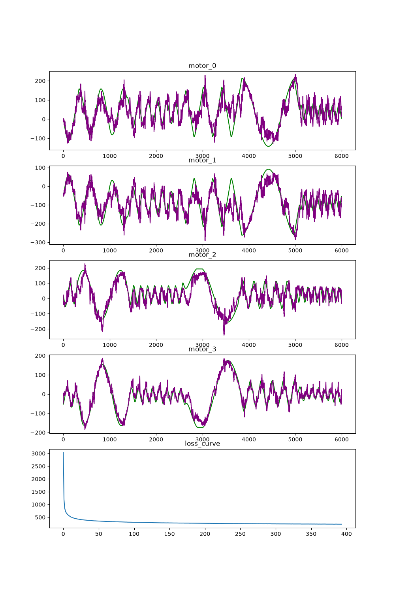
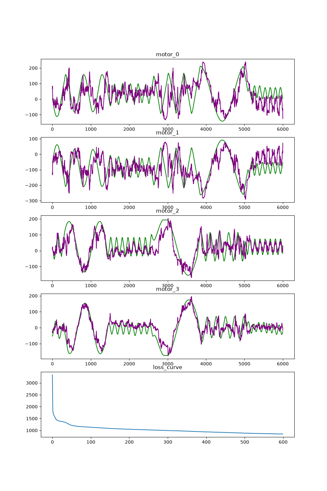
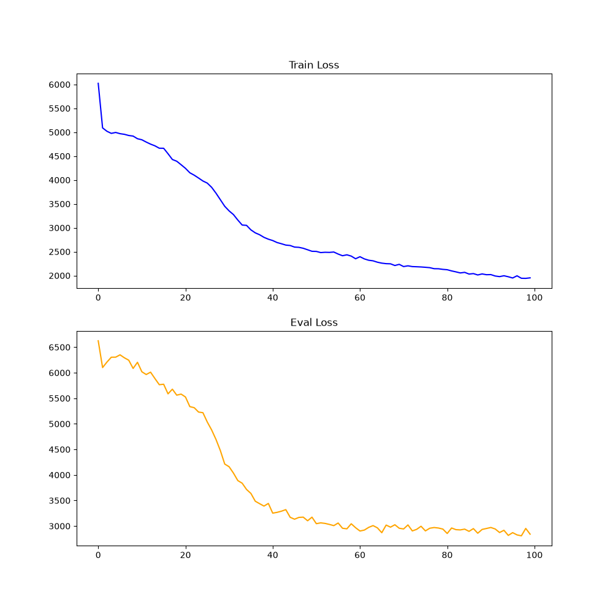

# motor_datagen

- 4 different dynamixel pro motors of 3 different types used 
(*max limits may be adjusted accordingly*)
- sin movement of various combinations & data collection (*plot+txt*)
- mlp trained to have xyz& prev_points' xyz as inputs and motor_deg as outputs 
- lstm added ;(
## Performance
### MLP with prev points

### MLP passing only XYZ of 3 points

### LSTM

## Etc
*notes*:
- *for my dataset based on optitrack rpy as input did not improve performance, though it might for many trajectories/slightly different steel script*
